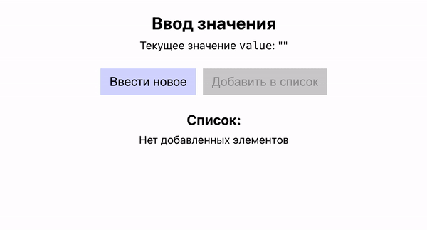

Разработка приложения с базовыми концепциями React. Готовая верстка: папка
`src/assets/template/index.html`. Базовые стили: папка `src/assets/template/style.css`.

С помощью React верстку необходимо "оживить", чтобы по итогу получилось следующее
приложение:

Функциональные требования по работе приложения:

-   при нажатии на кнопку 'Ввести новое' происходит запрос значения у пользователя с
    помощью `prompt()`;
-   значение должно состоять минимум из трех символов;
-   в случае если было введено менее 3 символов, на экране появляется сообщение с ошибкой;
-   если же было введено корректное значение, оно появляется на экране (в кавычках под
    заголовком);
-   если после этого еще раз нажать на кнопку 'Ввести новое', то снова произойдет запрос
    значения по правилам, описанным выше;
-   если нажать на кнопку 'Добавить' в список, то текущее введенное значение добавится в
    список ниже, а также удалится из кавычек под заголовком;
-   кнопка 'Добавить' в список заблокирована, если значение содержит менее 3 символов;
-   если в списке нет ни одного элемента, то показываем сообщение 'Нет добавленных
    элементов'.

Шаги по реализации:

Шаг 1. Подготовить стартовый React-проект. В качестве стартового проекта - сборщик Vite.

Шаг 2. Перенести верстку в React-компонент. В файле `index.html` элемент с классом `app`
(включая все дочерние теги) перенести в React-компонент `App`. В React-компонентах вместо
`class` используется `className`.

Далее перенести стили из файла `style.css` в файл `app.module.css`, а также часть в
корневые стили — файл `index.css` (часть, относящуюся к глобальным стилям). Затем в
JSX-разметке компонента `App` заменить обычные CSS-классы на классы CSS-модуля. Если
название класса написано через -, то использовать его можно следующим образом —
`className={styles['page-heading']}`.

После этого убедиться, что на странице выводится стилизованная разметка приложения (только
верстка, без интерактива).

Шаг 3. Создать состояния. С помощью `useState()` определить в приложении 3 состояния:

-   `value` — будет использоваться для ввода значения, по умолчанию пустая строка;
-   `list` — будет содержать элементы списка, по умолчанию пустой массив;
-   `error` — будет хранить текст ошибки, по умолчанию пустая строка.

Шаг 4. Добавить первый обработчик. В компоненте создать функцию `onInputButtonClick()` и
добавить ее как обработчик клика на кнопку 'Ввести новое'. Внутри функции запросить ввод
значения с помощью `prompt()` и вывести полученное значение в консоль. Убедиться, что
данный функционал работает.

Шаг 5. Вывод значения на экран. Внутри функции `onInputButtonClick()` полученное из
`prompt()` значение сохранить в обычную переменную `promptValue`. Далее в функцию
`setValue()` (получена из `useState()` при создании состояния `value`) передать новое
значение для `value` — переменную `promptValue`.

Теперь остается вывести `value` на экран. Найти место в JSX-разметке (тег `<output>`) и
вывести `value` внутрь него. Теперь убедиться, что после ввода `value` значение появляется
на экране.

Шаг 6. Валидация. После ввода значения `promptValue` внутри функции
`onInputButtonClick()`, добавить проверку, что строка `promptValue` содержит минимум 3
символа.

Если строка содержит менее 3 символов — устанавливать в состояние `error` (с помощью
`setError()` соответствующее сообщение об ошибке). Если строка содержит 3 и более символов
— устанавливать как раньше в состояние `value` значение `promptValue`, а также в состояние
`error` значение пустой строки. После этого выводить ошибку на экран. Для этого найти в
шаблоне `
` c классом `error` и вывести в него состояние `error`.

Однако, этого недостаточно. Также необходимо удалить этот `
` из разметки в случае,
если ошибок нет. Для этого воспользоваться условным рендерингом — выводить `
` только
в случае если `error !== ''`. После этого убедиться, что при вводе корректного значения
оно добавляется на экран, а при вводе некорректного — появляется сообщение об ошибке и
неправильное значение не добавляется на экран.

Шаг 7. Блокировка кнопки. В функции-компоненте `App` создать переменную — `isValueVaild`.
Она содержит значение типа `Boolean`:

-   `false` — в случае если `value` содержит менее 3 символов;
-   `true` — в случае если `value` содержит 3 и более символов. Передать эту переменную в
    атрибут кнопки 'Добавить' в список следующим образом: `disabled={!isValueVaild}`.

Шаг 8. Добавить второй обработчик. После этого в компоненте создать новую функцию —
`onAddButtonClick()` и сделать так, чтобы она вызывалась при клике на кнопку 'Добавить в
список'. Внутри этой функции в случае, если в `value` содержится корректное значение,
необходимо добавить `value` в массив (из состояния `list`), а также установить в состояния
`value` и `error` значения пустой строки (сделать сброс).

Но массив `list` будет содержать не просто строки из `value`, а объекты вида
`{ id: 1, value: '123' }`. Для того, чтобы добавить новый элемент в массив `list`,
необходимо передать новый обновленный массив в функцию `setList()`. Для этого создать
новую переменную `updatedList`, которая будет содержать массив с элементами массива `list`
(развернуть с помощью spread-оператора), а также нового элемента — объекта, структура
которого описана выше. Запись получится примерно следующая: const updatedList =
`[...list, { id, value }]`.

По итогу переменная `updatedList` должна содержать массив со всеми элементами массива
`list` + в конце новый объект со значением `value`. Для генерации `id` можно использовать
`Date.now()`. Переменную `updatedList` необходимо передать в функцию `setList()`.

Также при желании можно не создавать переменную updatedList от состояния `list`, а
использовать updater-функцию для `setList()`.

Шаг 9. Вывести список в `JSX`. В разметке вывести список из состояния `list` с помощью
метода массива `map()`. Элементы списка — объекты. Для вывода значения в тег `<li>`
использовать свойство объекта `value`, а в качестве `key` — свойство `id`.

Также, используя условный рендеринг, сделать так, чтобы:

-   при наличии элементов в массиве `list` на экран выводился список;
-   если элементов нет — на экран выводится сообщение 'Нет добавленных элементов'. После
    этого убедиться, что приложение исправно работает.

Дополнительно: в каждый элемент списка добавлять дату и время создания (в формате
`25.02.2027 16:06:54`).

Шаг 10. Добавить возможность удалить элемент списка (напр. использовать метод `filter`)
